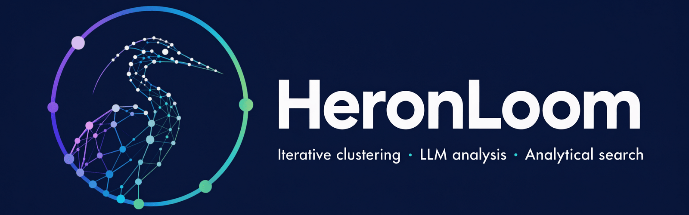
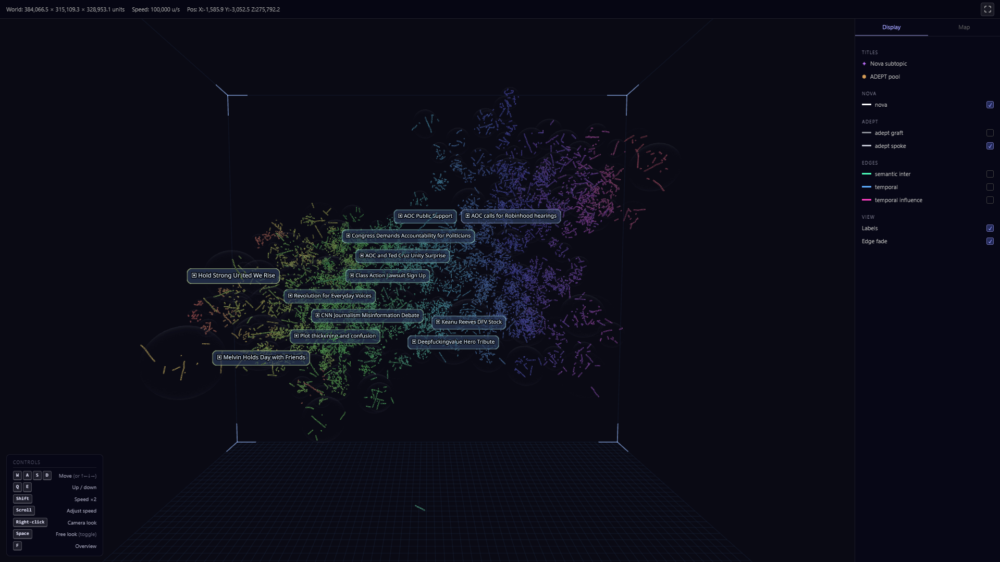
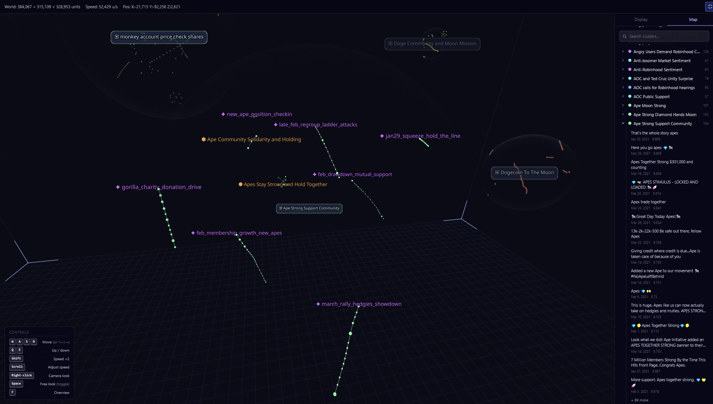
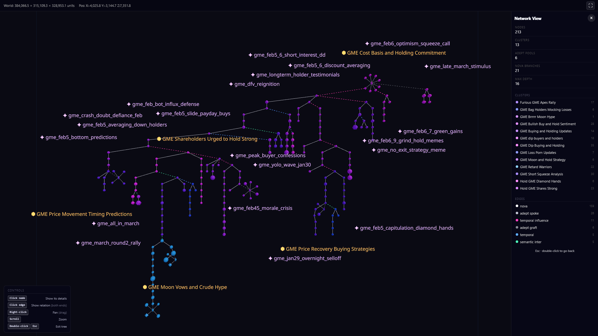
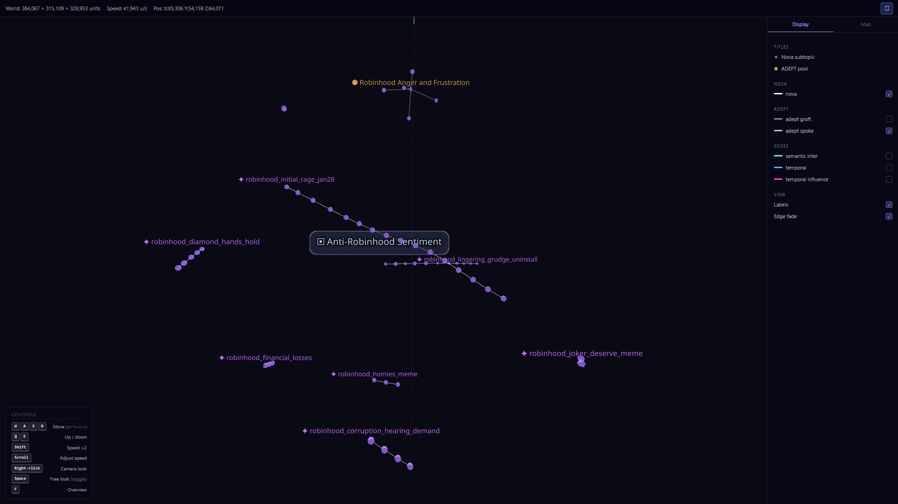
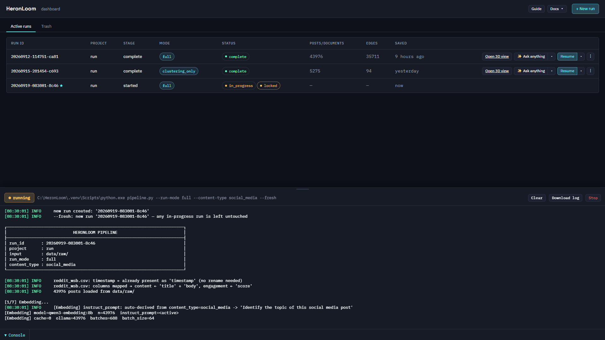
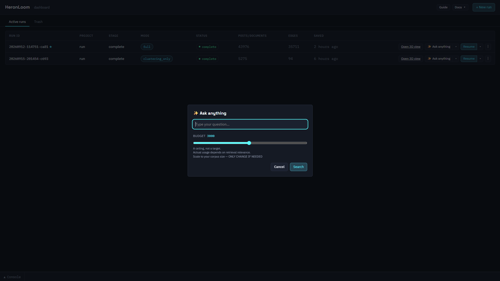

<div align="center">

# HeronLoom — Analyze trends, Measure sentiment, Predict what comes next



Turn social-media posts or documents into a structured, explorable 3D graph —
and ask analytical questions in natural language, with citations and a
confidence score. **No predefined categories, no manual annotation.**

[](https://www.python.org/)
[](LICENSE)

</div>

[Install](#-install) ·
[Quick start](#-quick-start) ·
[How it works](#-how-it-works) ·
[Documentation](#-documentation)

---

**HeronLoom** combines iterative clustering, LLM-based analysis, graph
construction, and analytical search in a single pipeline. It tracks how topics
and narratives evolve over time, identifies the signals driving those changes,
and makes every conclusion traceable to the underlying corpus.

Built for corpora of up to 50,000 posts or documents. The pipeline favours
clustering quality and analytical depth over raw throughput — larger corpora
may work but have not been systematically validated.

## ✨ What makes it different

- **Reconstructs how ideas change** — tracks topics, arguments, turning
  points, and changing interpretations across the corpus, instead of just
  producing a static list of topics.
- **Explains change over time** — goes beyond what people discussed to show
  what changed, when it changed, and what happened afterward.
- **Preserves conflicting interpretations** — keeps competing explanations
  visible instead of reducing them to a single narrative.
- **Separates claims from verified facts, and signals from outcomes** —
  repeated claims, theories, and interpretations aren't treated as evidence
  just because they are frequent or highly engaged with. When a signal is used
  to anticipate an outcome, the prediction is kept separate from the evidence
  of what actually happened.
- **Evidence-based confidence** — every conclusion shows what supports it,
  what remains uncertain, and where the evidence comes from, down to the
  original posts, timestamps, and quotes.
- **Built for noisy short-form text** — fragmentation, repetition, slang,
  sarcasm, mixed sentiment, and rapidly changing context make short-form
  content difficult to analyze reliably with text similarity or aggregate
  scores alone.

## 🌐 Demo

A complete run on [Reddit WallStreetBets Posts](https://www.kaggle.com/dsv/2530155) by Gabriel Preda, using raw posts from September 29, 2020 to April 1, 2021. After date filtering, the pipeline processes 43,976 posts covering the January 2021 GameStop short squeeze. No categories, keyword
seeds, or manual annotations are provided to the system. Every cluster, name,
narrative chain, and pool shown below is produced by the pipeline.

**[Open the live 3D graph →](https://korries.github.io/HeronLoom-demo/)**

**Two real questions asked to the system using this corpus — full answers with confidence scores below, no editing:**
- **Analyze trends + measure sentiment:**  
 [What were the main topics and sentiment in the 48h after Robinhood's trading restrictions?](examples/robinhood-restrictions-sentiment.md)
- **Predict what comes next:**  
[What do you think will happen next, after March 2021, to GameStop's stock, to Robinhood and Citadel, and to the hedge funds that bet against GameStop?](examples/after-March-2021.md)


*Note: Because the corpus (r/wallstreetbets) may contain offensive language,
source quotes have been removed from these two examples. The quotes are
retrieved from the corpus and are not part of the LLM's response.*

<p align="center">
  
  
</p>
<p align="center">
  
  
</p>
<p align="center">
  
  
</p>


## 📥 Install

**Requirements**

- Python 3.11+
- [Ollama](https://ollama.com/), for the embedding and cluster-naming models.
- An OpenAI- or Anthropic-compatible API endpoint for the `heavy` model,
  unless a local endpoint is configured. **For large corpora, a model with
  a 1M-token context window is recommended.**
- An NVIDIA GPU can accelerate computation:
  - [PyTorch](https://pytorch.org/get-started/locally/) for clustering
    (recommended). Select your CUDA version and run the corresponding install command.
  - [CuPy](https://docs.cupy.dev/en/stable/install.html) for edge computation
    — pick the wheel matching your CUDA Toolkit: `pip install cupy-cuda13x`
    (or `11x` / `12x`).

### 1. Clone the repository

```bash
git clone https://github.com/korries/HeronLoom.git
cd HeronLoom
```

### 2. Create a virtual environment

```bash
python -m venv .venv
source .venv/bin/activate
```

On Windows:

```bash
.venv\Scripts\activate
```

### 3. Install dependencies

```bash
python -m pip install -U pip
python -m pip install -r requirements.txt
```

Optional, for GPU acceleration — installing this later, in a new terminal?
Activate the virtual environment again first (step 2): you should see `(.venv)`
at the start of your prompt.
Example for CUDA 13.2:

```bash
python -m pip install torch torchvision --index-url https://download.pytorch.org/whl/cu132
python -m pip install cupy-cuda13x
```

### 4. Configure environment variables

```bash
cp .env.example .env
```

### 5. Pull the required Ollama models

```bash
ollama pull qwen3-embedding:8b
ollama pull qwen3.5:9b
```

Configure model slots in `config/config.yaml` before the first run. API keys go
in `.env`, never in configuration files. Provider setup, model selection, and
parallelism: [Configuration](docs/CONFIGURATION.md).

## 🚀 Quick start

Place your files in `data/raw/` — see [Input format](#input-format) below.

Then launch the dashboard:

```bash
python dashboard.py
```

Open `http://127.0.0.1:8000` and select **New run**. From there: launch the run,
ask questions, and open the 3D graph, all on the same page. See
[Dashboard](docs/DASHBOARD.md).

For scripting or automation, use the CLI instead — same `data/raw/` folder, no
dashboard needed:

```bash
python pipeline.py --input data/raw/
python reload.py search <run_id> "What were the main topics of discussion and the overall sentiment in the 48 hours following Robinhood's trading restrictions in late January 2021?"
```

A `clustering_only` mode is also available, for clustering purposes exclusively
— it skips the LLM analysis stages (Nova & ADEPT).

For the full flag reference, run `python pipeline.py --help` for the pipeline
or `python reload.py --help` for resume, restart, relabel, and search. See
[CLI reference](docs/CLI.md) for details.

## 🔎 How it works

1. **Ingestion & embeddings** — Input files are normalized into a common
   corpus format with automatic field detection and embedded with
   **Qwen3-Embedding**.
2. **Cluster-count estimation** — The number of clusters is determined
   automatically with GMM-BIC or set manually.
3. **Iterative refinement (ADR)** — The initial clustering is refined over
   several passes using discriminant projection and GMM re-clustering
   ([details](#clustering)).
4. **Cluster naming** — Labels are generated by the configured naming
   model, with a c-TF-IDF fallback.
5. **Nova & ADEPT** *(full mode only)* — Nova organizes each cluster
   into subtopics and narrative structure. ADEPT groups unassigned
   content into pools using Density Peak Clustering. See
   [Nova & ADEPT](docs/NOVA_ADEPT.md).
6. **Graph construction** — Edges capture temporal, semantic, and
   analysis-derived relationships within and between clusters
   ([edge definitions](docs/ALGORITHMS.md#edges)).
7. **3D layout** — ForceAtlas2 renders the graph as an interactive
   Three.js scene.
8. **Ask anything** — Once a run is finished, ask a natural-language
   question in any language and get answers with relevant corpus evidence,
   citations, and a confidence score. See [Search](docs/SEARCH.md).

A stage-flow diagram is in
[Architecture](docs/ARCHITECTURE.md#pipeline-stages).

## Input format

Accepted: `.json`, `.csv`, `.tsv`, `.txt`, `.md`, `.pdf`. Only text content is
required.

```json
{
  "id": "post_001",
  "content": "Text of the post.",
  "timestamp": "2026-06-01T14:30:00Z",
  "engagement": 142
}
```

`id`, `timestamp`, and `engagement` are optional; timestamps and engagement
enrich the graph when present. Non-standard field names can be mapped via
`field_mapping` in `config.yaml`.

## Clustering

HeronLoom's refinement loop is adapted from **TopiCLEAR**'s ADR loop (Fujita
et al., 2026): clusters are repeatedly refined instead of being fixed after a
single pass. TopiCLEAR itself builds on the **Adaptive Dimension Reduction
(ADR)** framework introduced by Ding & Li (2007), which alternates between an
LDA-based discriminant projection and k-means/GMM clustering within that
subspace.

HeronLoom replaces the original closed-form LDA step with **LDA-GO** (Shen &
Dong, 2025), which learns the discriminant subspace through gradient-based
optimization instead. This matters most on high-dimensional text embeddings —
and especially when the number of clusters is large relative to the sample
size — where the closed-form LDA solution routinely hits an invertibility
failure and becomes unreliable. LDA-GO avoids that failure mode and makes the
loop converge reliably in production.

The integration of LDA-GO into the TopiCLEAR-style refinement loop, along with
the surrounding implementation and stability engineering, represents
HeronLoom's own contribution.

Full mathematical treatment: [Algorithms](docs/ALGORITHMS.md).

## Security

The dashboard listens on `127.0.0.1` by default. Binding it to `0.0.0.0` to
expose it on a network does not add authentication on its own — read 
[Security](SECURITY.md) first.

## 📚 Documentation

- [Configuration](docs/CONFIGURATION.md)
- [Dashboard](docs/DASHBOARD.md)
- [CLI reference](docs/CLI.md)
- [Performance](docs/PERFORMANCE.md)
- [Render](docs/RENDER.md)
- [Search](docs/SEARCH.md)
- [Architecture](docs/ARCHITECTURE.md)
- [Algorithms](docs/ALGORITHMS.md)
- [Nova & ADEPT](docs/NOVA_ADEPT.md)

## 🙏 Acknowledgements

Thanks to the authors of TopiCLEAR and LDA-GO for their open-source contributions.

## 📄 License

HeronLoom is licensed under the GNU Affero General Public License v3.0
(AGPL-3.0). See the [LICENSE](LICENSE) file.

Third-party code and dependencies keep their own licence terms. See
[Third-party notices](THIRD_PARTY_NOTICES.md).

## ✉️ Contact

For questions, suggestions, or collaboration, please feel free to reach out:
[korprotech@gmail.com](mailto:korprotech@gmail.com)
