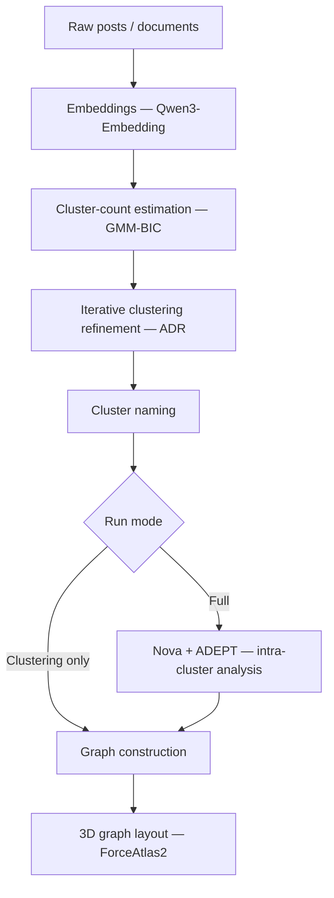

# Architecture

The HeronLoom programs, the order the pipeline stages run in, and what a run leaves on disk.

## Pipeline stages



The console labels these `[1/7]` … `[7/7]`: embedding (two passes, see below), cluster-count estimation, ADR, naming, Nova + ADEPT or edges, ForceAtlas2, save. Both run modes end with edge construction and 3D layout; `clustering_only` only skips Nova and ADEPT.

The embedding stage writes **two** stores. `embeddings.parquet` carries the clustering embeddings, built with the `content_type` instruction prefix. `embeddings_retrieval.parquet` carries the same posts embedded from raw text with no prefix, which is the document side of the asymmetric retrieval convention `search.py` relies on. See [`ALGORITHMS.md`](ALGORITHMS.md#embedding).

For the math behind each stage, see [`ALGORITHMS.md`](ALGORITHMS.md).

## Components

Four programs, one shared library, one on-disk run format.

```
            ┌───────────────┐
 raw files  │  pipeline.py  │  writes a run
 ─────────► │  (the engine) │ ─────────────┐
            └───────────────┘              │
                                            ▼
┌───────────────┐   reads/writes   ┌──────────────────┐
│  reload.py    │ ───────────────► │  runs/<run_id>/  │
│  (CLI browser)│ ◄─────────────── │  (run_store.py)  │
└───────────────┘                  └──────────────────┘
                                            ▲
┌───────────────┐   spawns pipeline.py /    │
│  dashboard.py │   reload.py as a          │
│  (web UI)     │   subprocess, reads runs  │
└───────────────┘ ──────────────────────────┘
                                            ▲
┌───────────────┐   reads output/,          │
│  search.py    │   appends to searches/    │
│  (analysis)   │ ──────────────────────────┘
└───────────────┘
```

- **`pipeline.py`** — the engine.
  - Reads input files, runs every stage in order, writes progress to the run folder as it goes.
  - The only program that computes anything.
- **`run_store.py`** — shared library, not a program.
  - Imported by every other file. Creates, locks, checkpoints, and reads run folders.
- **`reload.py`** — CLI browser.
  - Reads a run's saved state, never computes new clustering.
  - `--resume-from` hands control back to `pipeline.py` to continue the run.
- **`dashboard.py`** — web UI.
  - Reads runs directly for read-only actions: listing runs, showing progress.
  - For anything that computes or mutates state, launches `pipeline.py` or `reload.py` as a subprocess in a terminal the browser can watch and type into.
- **`search.py`** — analytical search.
  - Reads a finished run's Parquet output plus its sidecar metadata.
  - Does not use `run_store.py`'s write path and never touches computed state. It does append its own transcripts to `runs/<run_id>/searches/`.

## Source layout and imports

**HeronLoom is an application, not an importable library.** It runs from a
checkout of the repository. `pip install -r requirements.txt` installs the
third-party libraries it needs and nothing else: no part of this project is
copied into the Python environment, and there is no build step. That is why
`pyproject.toml` carries no `[build-system]` and no `[project]` table — those
describe a distributable package, and there is no package here.

Two directories are on the import path at runtime:

- the **repository root**, because Python always puts the directory of the script
  being run at the front of `sys.path`. This is what makes `import run_store`,
  `from utils.logger import get_logger` and `from webapp import docs_api` work.
- **`src/`**, injected explicitly by each entry point:
  `sys.path.insert(0, str(Path(__file__).parent / "src"))`. This is what makes
  `import nova`, `import edges`, `import fa2_layout` work.

Consequences worth knowing:

- Commands are run from the repository root (`python pipeline.py …`). Running the
  entry points by absolute path from another working directory also works, since
  both paths are derived from `__file__`, never from the current directory.
- Anything that is **not** one of the four entry points has to put `src/` on the
  path itself. `pytest` does it through `pythonpath = [".", "src"]` in
  `pyproject.toml`; that line is load-bearing, not decoration.
- Because nothing is packaged, `import pipeline` from an arbitrary Python process
  is not expected to work and never was. Use the entry points.
- Moving a module between the repository root and `src/` changes nothing for the
  code, since both are on the path — but keep the split meaningful: entry points
  and `run_store.py` at the root, stage modules in `src/`.

## What a run folder contains

`run_store.py` creates `runs/<run_id>/` when a run starts and writes into it after each stage finishes, not only at the end.

```
runs/<run_id>/
├── run.json                      run identity: run_id, cli_args, started_at,
│                                  finished_at, stage, status, relabeled_at
├── config_snapshot.yaml          the config frozen at launch
├── k_cache.pkl                   chosen cluster count + seed labels
├── adr_refiner.joblib            fitted ADR model (adr.py's save_models)
├── cluster_stats.parquet         per-cluster size and LDA-space centroid
├── embeddings.parquet            clustering embeddings (instruction-prefixed)
├── embeddings_retrieval.parquet  retrieval embeddings (raw text, no prefix)
├── nova_assignments.parquet      Nova post assignments, reused across runs
├── nova_edges.parquet            Nova edges, reused across runs
├── nova_checkpoint.json          live only while Nova is unfinished or unvalidated
├── nova_metadata.parquet         subtopic titles, reasoning, sentiment arcs
├── adept_assignments.parquet     ADEPT post roles and normalized engagement
├── adept_edges.parquet           ADEPT hub → member spoke edges
├── adept_checkpoint.json         live only while ADEPT is unfinished or unvalidated
├── adept_metadata.parquet        per-cluster orphan / pool / edge counts
├── adept_exclusions.parquet      one row per LLM-excluded pool candidate
├── pool_explanations.parquet     ADEPT pool titles and reasoning
├── checkpoints_archive/          Nova / ADEPT checkpoints, moved here once the pass validated
├── stages/
│   ├── adr/{posts.parquet, meta.json}
│   ├── naming/{posts.parquet, meta.json}
│   ├── nova/{posts.parquet, edges.parquet, meta.json}
│   ├── adept/{posts.parquet, edges.parquet, meta.json}
│   ├── edges/{posts.parquet, edges.parquet, meta.json}
│   └── fa2/{posts.parquet, edges.parquet, meta.json}
├── output/                       written once status == "complete"
│   ├── clusters.parquet              full table, with embedding columns
│   ├── clusters_render.parquet       same, without embeddings (render.py's input)
│   └── edges.parquet                 the final merged edge list
├── searches/                     one Markdown transcript per search.py answer
└── render.html                   written from output/, at the run root
```

Two groups of files are easy to confuse:

- `stages/nova/` is the **resume checkpoint**, read by `--resume-from nova`.
- `nova_assignments.parquet` and `nova_edges.parquet` at the run root are the **reuse cache**, which a new run picks up to skip recomputing Nova. `--force-nova` ignores these, not `stages/nova/`. They are only reused when `nova_checkpoint.json` is absent, since a live checkpoint means the last Nova attempt never passed validation.

The per-stage column schemas for every `nova_*` and `adept_*` file above are in
[`NOVA_ADEPT.md`](NOVA_ADEPT.md#outputs).

`meta.json` records at least the `run_mode` a stage ran under. `--resume-from edges` and `--resume-from fa2` check it before resuming, and resuming a `clustering_only` checkpoint with `--run-mode full` fails rather than producing a run that looks full but has no Nova/ADEPT edges.

## Locking

- `run_store.py` locks each run with the `filelock` package, scoped to that run's own folder.
- Two different runs can run in parallel. The same run cannot be touched by two processes at once.
- The lock is an OS-level `FileLock`, so if a process dies (crash, `Ctrl+C`, `kill -9`) the kernel releases it immediately and the run can be resumed straight away.

## Logs

Logs live outside `runs/<run_id>/`: one rotating file per day at `logs/YYYY-MM-DD.log` in the project root.

- **Rotation** — 10 MB per file, 5 backups kept (`logs/YYYY-MM-DD.log.1` … `.5`).
- **Levels** — the console shows INFO and above, or DEBUG and above with `--debug`. The file always captures DEBUG and above regardless of the console flag.
- **`NOTICE` (25)** — a custom level between INFO and WARNING, added in `utils/logger.py` and available as `logger.notice(...)` on every logger. It carries actionable tips that are not warnings (nothing is wrong), such as "you are running sequentially on 113 clusters, here is how to speed that up". Colour comes from `colorlog`, which is an optional import: without it the console output is uncoloured but otherwise identical.
- **Multi-process safety** — `dashboard.py` and the `pipeline.py` / `reload.py` subprocess it launches can hold the same day's file open at once. `concurrent-log-handler` (a core dependency) makes that rotation safe. If it is ever missing, `logger.py` falls back to the stdlib handler and prints a one-time warning; in that fallback mode rotations can race and log lines can be dropped silently.
- **Reading** — tail the file directly, or use the dashboard's live output panel and **Download log** button.
- Not configurable from `config.yaml`. Path, rotation size, and retention are fixed in `utils/logger.py`.

## See also

- [`CONFIGURATION.md`](CONFIGURATION.md) — every key in `config.yaml` and `advanced.yaml`
- [`CLI.md`](CLI.md) — full flag reference for all four entry points
- [`ALGORITHMS.md`](ALGORITHMS.md) — the math behind each stage, with citations
- [`DASHBOARD.md`](DASHBOARD.md) — the web UI and its security model
- [`RENDER.md`](RENDER.md) — the 3D view and Tree View
